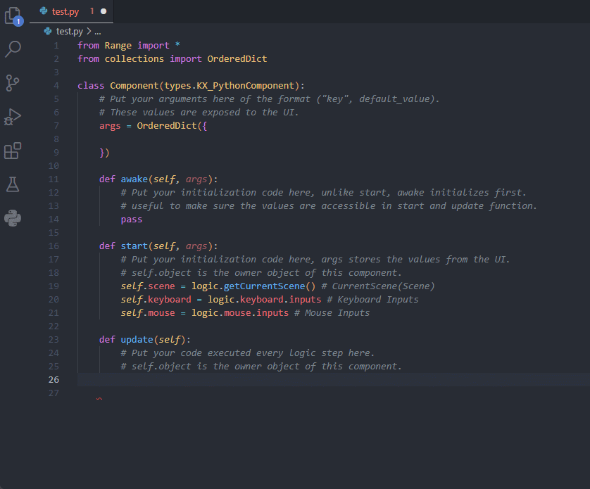

# range-engine-api README

Range Engine Autocomplete is an extension for Visual Studio Code that provides autocompletion and type hinting support for the Range Engine. 
Python language support.

**Enjoy!**